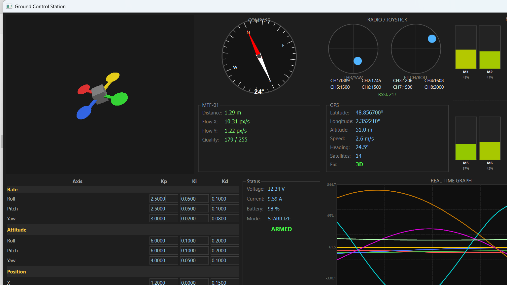

# Ground Control Station



A desktop Ground Control Station (GCS) for a custom quadcopter drone, built with **C++17** and **Qt6**.

The drone communicates with the GCS over **WiFi UDP at 100 Hz**. Communication is bidirectional: the drone streams telemetry continuously, and the GCS can send configuration commands back.

---

## Features

| Widget | Description |
|--------|-------------|
| **3D Drone View** | Real-time OpenGL model that rotates with the live attitude quaternion |
| **Compass** | Rotating 2D compass dial with heading in degrees |
| **Radio / Joystick** | Two virtual sticks driven by receiver channel values + RSSI |
| **MTF-01** | Laser rangefinder distance, optical flow X/Y, quality |
| **GPS** | Lat/Lon/Alt/Speed/Heading/Satellites/Fix type with color indicator |
| **Motor Gauges** | 4 vertical bars (M1–M4), green → yellow → red |
| **PID Config** | Editable Kp/Ki/Kd for Rate / Attitude / Position axes, Send per group |
| **Real-Time Graph** | Rolling 10 s graph, 8 configurable curves with per-curve toggles |
| **Terminal** | Color-coded drone log stream (DEBUG / INFO / WARN / ERROR) |
| **Status Bar** | Connection state, UDP latency, WiFi RSSI, packet loss %, drone IP |

---

## Tech Stack

| Component | Technology |
|-----------|------------|
| Language | C++17 |
| UI Framework | Qt6 Widgets |
| 3D Rendering | OpenGL (QOpenGLWidget) |
| Build System | CMake 3.16+ |
| Network | QUdpSocket (Qt6 Network) |

---

## Architecture

```
src/
├── main.cpp
├── backend/                    # No Qt Widget dependency
│   ├── Protocol.h              # All packet structs (packed), type IDs, enums
│   ├── TelemetryState.h/.cpp   # Mutex-guarded drone state snapshot
│   ├── PacketParser.h/.cpp     # CRC-16/CCITT validation, multi-packet datagrams
│   ├── UdpLink.h/.cpp          # UDP socket (dedicated thread), 2 s timeout
│   └── CommandSender.h/.cpp    # PID command builder, ACK retry (3× / 200 ms)
└── ui/
    ├── MainWindow.h/.cpp       # Layout, dark theme, signal wiring
    └── widgets/
        ├── DroneWidget3D       # OpenGL quaternion visualiser
        ├── CompassWidget       # Custom paintEvent compass
        ├── JoystickWidget      # Virtual dual-stick display
        ├── Mtf01Widget         # MTF-01 sensor readout
        ├── GpsWidget           # GPS data panel
        ├── MotorWidget         # Motor throttle gauges
        ├── PidConfigWidget     # PID editor + drone status
        ├── GraphWidget         # Rolling real-time multi-curve graph
        └── TerminalWidget      # Scrollable color-coded log
```

**Threading model**
- **Main thread** — Qt UI only
- **Network thread** — `UdpLink` + `CommandSender` live on a `QThread`
- Cross-thread data via `Qt::QueuedConnection` signals — no raw shared state except the mutex-guarded `TelemetryState`

---

## UDP Protocol

All packets share a common 12-byte header followed by a **CRC-16/CCITT** checksum. A single datagram may contain multiple back-to-back packets.

### Drone → GCS

| Type | Name | Rate |
|------|------|------|
| `0x01` | Attitude (quaternion + gyro + accel) | 100 Hz |
| `0x02` | GPS | 10 Hz |
| `0x03` | MTF-01 (optical flow + laser) | 50 Hz |
| `0x04` | Radio receiver (8 channels + RSSI) | 50 Hz |
| `0x05` | Status (battery, arm state, motors) | 10 Hz |
| `0x06` | PID values | On change |
| `0x07` | Log / terminal text | On event |

### GCS → Drone

| Type | Name | ACK |
|------|------|-----|
| `0x10` | Set PID coefficients | Yes — retried up to 3× with 200 ms timeout |

---

## Build

### Requirements

- **Qt 6.x** (Widgets, Network, OpenGL, OpenGLWidgets modules)
- **CMake 3.16+**
- **MSVC 2022** (Windows) or **GCC/Clang** (Linux)

### Windows (MSVC)

```bash
cmake -B build -DCMAKE_BUILD_TYPE=Release -DCMAKE_PREFIX_PATH="C:/Qt/6.x.x/msvc2022_64"
cmake --build build --config Release --parallel
```

Run the app and the simulator (opens in a separate window, close with Ctrl+C):

```bash
start build/Release/GroundControlStation.exe
start "GCS Simulator" cmd /k "py simulator.py"
```

Deploy Qt DLLs next to the executable:

```bash
C:/Qt/6.x.x/msvc2022_64/bin/windeployqt.exe build/Release/GroundControlStation.exe
```

### Linux (GCC)

```bash
cmake -B build -DCMAKE_BUILD_TYPE=Release -DCMAKE_PREFIX_PATH="/opt/Qt/6.x.x/gcc_64"
cmake --build build --parallel
```

---

## Network Configuration

| Setting | Default |
|---------|---------|
| GCS listen port | `5005` |
| Drone → GCS | Drone streams continuously; GCS is passive on RX |
| GCS → Drone | Replies to the last known drone `IP:port` |
| Connection timeout | **2 seconds** without a packet → disconnected state |

---

## License

Private project — all rights reserved.
